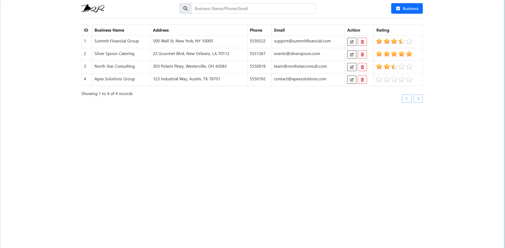
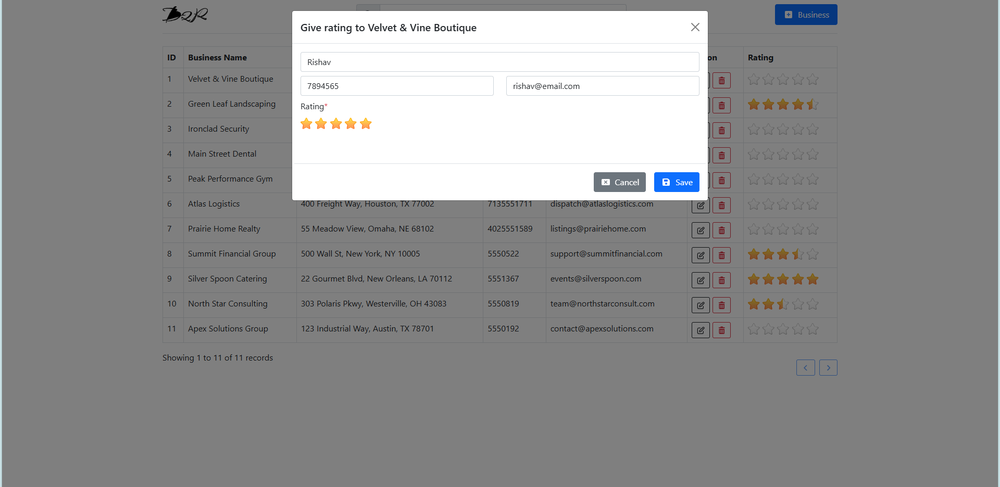
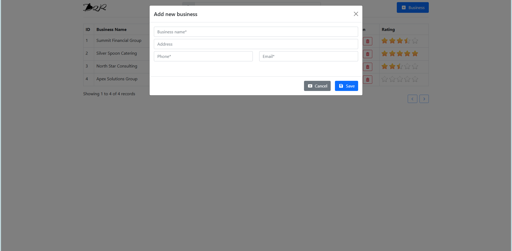
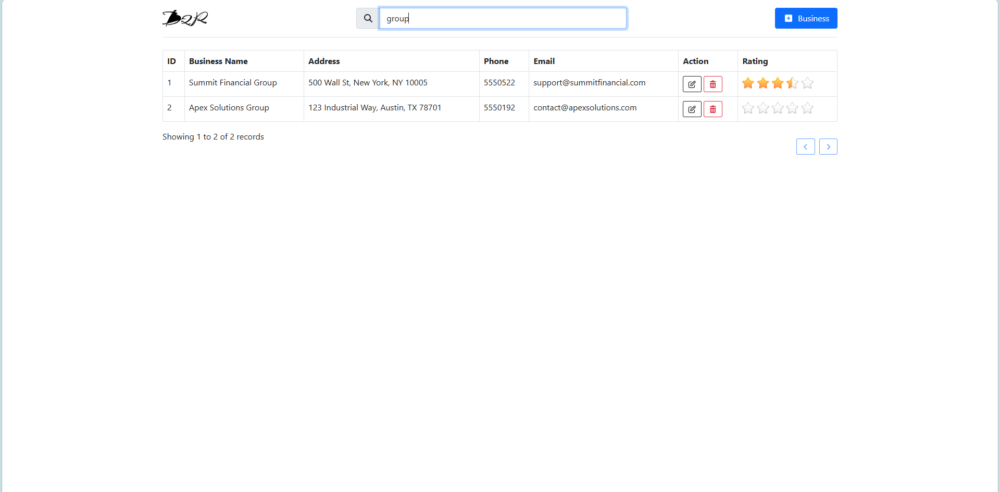

# business2rate

## 📑 Table of Contents

- [Overview](#business-listing--rating-system)
- [Features](#features)
  - [Business Management](#business-management)
  - [Rating System](#rating-system)
  - [Security](#security)
  - [Performance Optimizations](#performance-optimizations)
- [Tech Stack](#tech-stack)
- [Project Structure](#project-structure)
- [Setup Instructions](#setup-instructions)
  - [1. Clone Project](#1-clone-project)
  - [2. Configure Database](#2-configure-database)
    - [Create Database](#create-database)
    - [Create Tables](#create-tables)
    - [Key Setup](#key-setup)
    - [Constraints Setup](#constraints-setup)
  - [3. Configure Database Connection](#3-configure-database-connection)
  - [4. Enable Pretty URLs](#4-enable-pretty-urls-remove-php)
  - [5. Start Server](#5-start-server)
- [API Endpoints](#api-endpoints)
  - [Business APIs](#business-apis)
  - [Rating APIs](#rating-apis)
- [CSRF Protection](#csrf-protection)
- [Pagination Logic](#pagination-logic)
- [Search Optimization](#search-optimization)
- [Rating Rules](#rating-rules)
- [Security Measures](#security-measures)
- [Future Improvements](#future-improvements)
- [Screenshots](#screenshots)
- [Submission Checklist](#submission-checklist)

## Business Listing & Rating System

A lightweight, high-performance Business Listing & Rating System built using **Core PHP, MySQL, jQuery, AJAX, and Bootstrap 5**. This project demonstrates CRUD operations, real-time UI updates, and a dynamic rating system using the Raty plugin — all without page reloads.


## Features

### Business Management

* Add, Edit, Delete businesses using Bootstrap Modals
* AJAX-based operations (no page refresh)
* Search functionality (debounced for performance)
* Pagination

### Rating System

* Star rating using Raty plugin
* Supports half-star ratings (0–5 scale)
* One rating per user per business (email/phone based)
* Updates existing rating if user re-submits
* Real-time average rating calculation

### Security

* CSRF protection (token regenerated on every request)
* Clickjacking protection (X-Frame-Options header)
* Input validation (frontend + backend)
* Prepared statements (PDO) to prevent SQL injection

### Performance Optimizations

* Debounced search (reduces API calls)
* Efficient pagination handling
* Optimized database queries

---

## Tech Stack

* **Backend:** Core PHP (OOP)
* **Database:** MySQL
* **Frontend:** HTML, Bootstrap 5
* **JS Libraries:** jQuery, AJAX
* **Plugin:** Raty (Star Rating)

---

## Project Structure

```
/business2rate
│── /api
│     └── index.php          # Main API entry point
│
│── /assets
│     ├── /js
│     ├── /images            
│
│── /classes
│     ├── Business.php       # Business APIs (CRUD)
│     ├── Rating.php         # Rating APIs
│
│── /config
│     ├── config.php         # All configs
│     ├── database.php       # DB connection (PDO)
│     ├── helpers.php       
│     ├── security.php       
│
│── index.php                # Main UI
│── .htaccess                
│── README.md
```

---

## Setup Instructions

### 1. Clone Project

```bash
git clone <repo-url>
cd business2rate
```

---

### 2. Configure Database

#### Create Database

```sql
CREATE DATABASE business2rate;
```

---

#### Create Tables

```sql
CREATE TABLE businesses (
    id VARCHAR(36) PRIMARY KEY,
    name VARCHAR(255),
    address TEXT,
    phone VARCHAR(20),
    email VARCHAR(255),
    status enum('1','5') NOT NULL DEFAULT '1',
    created_at TIMESTAMP DEFAULT CURRENT_TIMESTAMP
);

CREATE TABLE ratings (
    id VARCHAR(36) PRIMARY KEY,
    business_id VARCHAR(36),
    name VARCHAR(255),
    email VARCHAR(255),
    phone VARCHAR(20),
    rating DECIMAL(2,1),
    status enum('1','5') NOT NULL DEFAULT '1',
    created_at TIMESTAMP DEFAULT CURRENT_TIMESTAMP
);
```

---

#### Key Setup

```sql
ALTER TABLE `businesses`
  ADD KEY `idx_name` (`name`);

ALTER TABLE `ratings`
  ADD KEY `idx_business_id` (`business_id`);
```

---
#### Constraints Setup

```sql
ALTER TABLE `ratings`
  ADD CONSTRAINT `ratings_ibfk_1` FOREIGN KEY (`business_id`) REFERENCES `businesses` (`id`) ON DELETE CASCADE;
```

---

### 3. Configure Database Connection

Edit:

```
/config/config.php
```

```php
$host = "";
$db = "business2rate";
$user = "";
$pass = "";
$limit=25;
```

---

### 4. Enable Pretty URLs (Remove .php)

Create `.htaccess` in root:

```apache
RewriteEngine On
RewriteBase /business2rate/

RewriteRule ^api/([a-zA-Z]+)/([a-zA-Z]+)$ api/index.php?type=$1&action=$2 [QSA,L]

RewriteCond %{REQUEST_FILENAME} !-d
RewriteCond %{REQUEST_FILENAME}.php -f
RewriteRule ^([^\.]+)$ $1.php [L]
```

---

### 5. Start Server

#### Using XAMPP / WAMP

Place project in:

```
htdocs/business2rate
```

Open:

```
http://localhost/business2rate
```

---

## API Endpoints

### Business APIs

| Method | Endpoint               | Description     |
| ------ | ---------------------- | --------------- |
| GET    | `/api/business/list`   | List businesses |
| POST   | `/api/business/add`    | Add business    |
| POST   | `/api/business/update` | Update business |
| POST   | `/api/business/delete` | Delete business |

---

### Rating APIs

| Method | Endpoint              | Description        |
| ------ | --------------------- | ------------------ |
| POST   | `/api/rating/add`     | Add/Update rating  |

---

## CSRF Protection

* Token generated per request
* Sent via:

  * Header: `X-CSRF-TOKEN`
* Backend validates every request
* Token refreshed after every response

---

## Pagination Logic

* Default limit: 25
* Auto-adjust page after delete
* URL synced using History API:

```
?page=2&limit=25&search=test
```

---

## Search Optimization

* Debounced input (400ms delay)
* Prevents excessive API calls
* Cancels previous requests

---

## Rating Rules

* Same business + same email/phone → update rating
* Different business → new entry
* Real-time average calculation

---

## Security Measures

* PDO prepared statements
* Input sanitization
* CSRF token rotation
* Clickjacking prevention:

```php
header('X-Frame-Options: SAMEORIGIN');
```

---

## Future Improvements

* Server-side caching (Redis)
* API rate limiting
* Role-based authentication

---

## Screenshots

| Business Listing | Rating Modal |
|-----------------|-------------|
|  |  |

| Add Business | Search |
|-------------|--------|
|  |  |

---

## Submission Checklist

✔ CRUD operations working

✔ AJAX (no refresh)

✔ Rating system implemented

✔ Pagination & search

✔ Security implemented

✔ Clean and modular code
